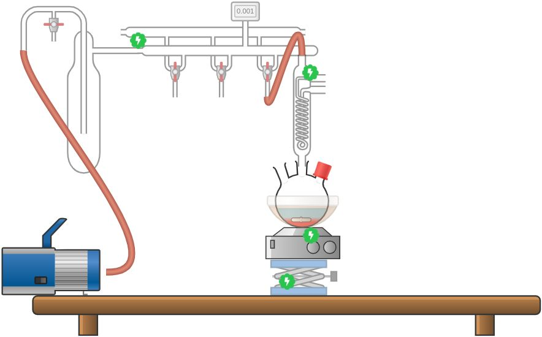

# Start

## The Schlenk Line

    The schlenk line is is a chemical apparatus that is used in synthesis of substances where the chemicals used are volatile when exposed atmosphere.

> This is the default configuration of the schlenk line.
